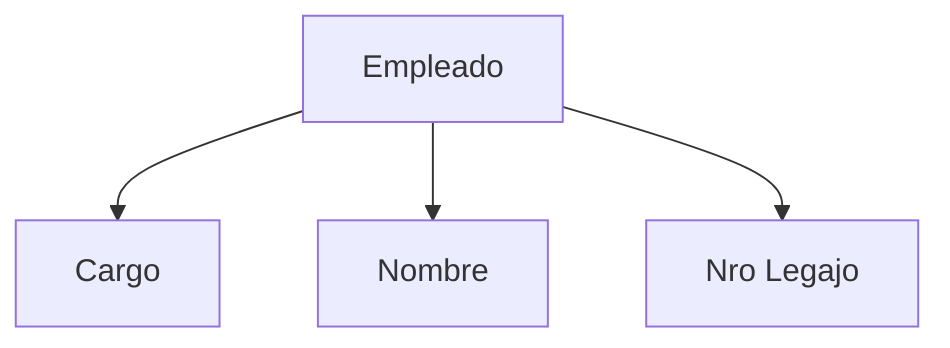

# Práctica - 19/08

## Presentación

- 2 parciales
  - 1er parcial
    - DER/MER
    - Normalización
    - AR CRT
  - 2do parcial
    - concurrencia y recuperabilidad
    - noSQL
- Laboratorios
  - SQL
  - Optimización

## Overview MER

**Todo DER** tiene que tener claves y atributos, (a veces los vamos a
obviar).
El **MER** lo hacemos con **D**iagramas **E**ntidad **R**elación. Ahí tenemos:

- relaciones
  - unarias
  - binarias
  - ternarias
- cardinalidad: nro de elementos de una entidad que se relacionan con otro.
  - uno a uno
  - uno a muchos
  - muchos a muchos
- participación: cuántos elementos del conjunto pertenecen a la relación:
  - parcial: sólo una parte del conjunto está relacionado con algún otro.
  - total: todos están en algún elemento de la relación.

Ej:

- rol: el rol de una entidad en una relación.
  - en una unaria es necesario agregarlo para evitar ambiguedades.
  - siempre tiene que haber una participación parcial

- Las únicas interrelaciones que admiten atributos son las M:N.
  - Más de 1, 2 atributos no deberían haber. Pensar si esa relación no es mejor una entidad.
  - No debería tener que agregar un atributo identificador artificial

### Ternarias
- para leerlo tomo de a pares. ej:
  > Un instructor en un conjunto de semestres da varias materias
- se toman de a pares las entidades, y tiene que tener sentido que
  para cada par de elementos de dos entidades tienen que estar
  relacionado con uno del resto.
  - Ojo, es distinto a participación total/parcial
- binarias o ternarias?
  - Idealmente quiero el modelo más simple
  - Pero hay casos que binaria no alcanza. Ej:
  > José ensenó bases de datos en el 1er cuat de 1964. 
  - Sin embargo, con una binaria puedo saber que:
    - José ensenó bases de datos
    - Bases de datos se dio en el 1er cuat de 1964
    - José ensenó en el 1er cuat de 1964
  - ... No puedo recuperar toda la info
  - cuando le meto la ternaria, me doy cuenta de que hay redundancia y puedo sacar las binarias

### Jerarquías
- Particiono con algún sentido una entidad
  - una entidad e1, e2 cumple que `es_un(e1, e2)` cuando es una subentidad de otra
- **HEREDAN** la clave de la superentidad
- cobertura
  - total, cuando cubro todo
  - parcial (marco con circulito en la superentidad como con las relaciones comunes)
- solapamiento
  - disjuntas (marco con una `d`)
  - con solapamiento
- pistas para subentidades:
  - una parte siempre se relaciona con algo y la otra no
  - una parte tiene un atributo que la otra no
- puedo armar varias jerarquías para una misma entidad

### Agregación

Supongamos por ejemplo, que tenemos docentes, materias y algunos
cursos realizan encuestas de evaluación docentes. Un docente dando una
materia puede no recibir encuestas, entonces no puedo usar una
ternaria. Y si la encuesta fuese obligatoria? Tampoco, porque no puedo
cargar al docente/materia hasta recibir la primer encuesta. 

Con agregación, trato a una interrelación (junto a las entidades
vinculadas) como una entidad en sí mismo. **Sólo es posible** en relaciones **M:N**

Hay un apunte sobre todo esto en el campus.

## Consideraciones de diseno

- Respetar requerimientos
- evitar redundancia
- entidad o atributo? ej:

- Entidad o interrelacion?
  - Muchos atributos?
  - Se complica la búsqueda de información?
  - Entidad débil
    - Una entidad que depende completamente de otra
    - La clave se forma con algún ID + la clave de la fuerte
    - Ej: items de una factura, asientos de un avión
- Sustantivos en singular para entidades
- Verbos para interrelaciones
- de izquierda a derecha y arriba a abajo
- replicar entidades (agregarles una marca para que se note que es la
  misma entidad)
- Elegir __buenas claves__
  - Inmutable
  - En muchos casos se genera una clave artificial (surrogateKey)
- Ojo con trampas
  - Fan traps
    - El camino entre entidades es ambiguo (suele pasar con varias **1:N**)
  - Sink traps
    - Parece que hay una relación entre entidades pero en el camino se pierde.
    - Suele pasar cuando hay relaciones parciales.
  - En el parcial, prestar atención a los requerimientos de las consultas.
- Las cosas importantes que no se pueden representar van a la sección de restricciones adicionales
  
